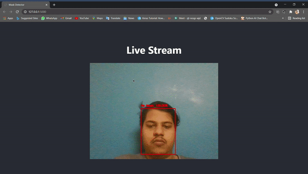

# MaskDetector 
##  This is an Mask detection system to detec if user is wearing the mask or not. This kind of problem is very simple since its binary classification I have used pretrained model MobilenetV2 for this project as model head and base head used is simple dense layer with sigmoid activation. Most intresting part of this project is its deploying if you read the app.py code cearly you can see that you are able to customize which camera we can choose. This means instead of using your web cam we can also use and IP camera or Raspberry pi doing this will enable to stream as well as applying our model on the frames captured by raspberry pi

# Demo

